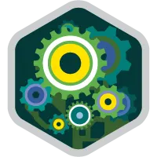
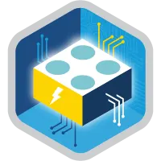
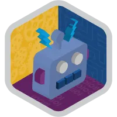
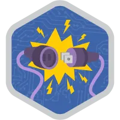

Apaixonado por **tecnologia**, aos 16 anos descobri a programação com um projeto de criação de um **website** com um amigo, aprendi como criar pagina Web estático, adicionar efeitos com **JS**, e a utilizar o **PHP** com banco de dados, e a trabalhar com como hospedagem. A partir deste ponto corri atrás para descobrir como funcionava as coisas, aprendi o básico utilizando C, PASCAL, JAVA, C++ entre outras.

> "Sempre busquei conhecimento e novos desafios sem medo do desconhecido."

Em 2012 inicie a Faculdade de **Bacharelado em Sistemas de Informação**  onde já sabia muito sobre **PHP** e **WordPress**, neste meio tempo, fiz vários freelancer com desenvolvimento web, trabalhando com **Responsive web design** (RWD), **Web Performance**, e WordPress. 

Estudei **Mainframe**, **Cobol**, **DB2**, **CISC**, **Linux** e diversos banco de dados. Desenvolvi WebApps (PWAs) no antigo ecossistema **Firefox OS** e com o **IntelXDK**.

No meu tempo livre atuei com ReactJS, React Native, NodeJS e todo ecossistema em torno dessas tecnologias desenvolvendo projetos pessoais e freelancer.

Em 2021 comecei a trabalhar com SalesForce, atuando com Apex, LWC, Aura, Visual Force, Flows e demais tecnologias em torno.

#BoraCodar

    
    
    
    
    

